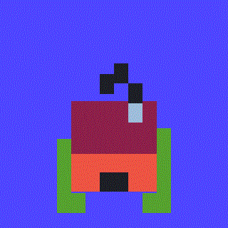

# stacker

A program for making pixel art look "3D"
using sprite stacking technique 

still unfinished.
 
 features missing:
   - loading and saving project
   - notifications
  
known bugs
   - gif exporter is broken
   - preview spritestack doesn't center correctly
